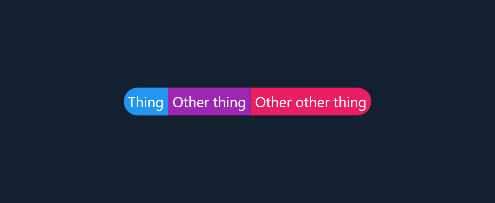
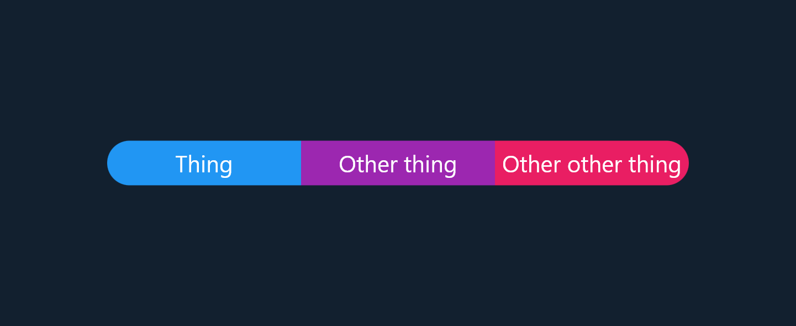
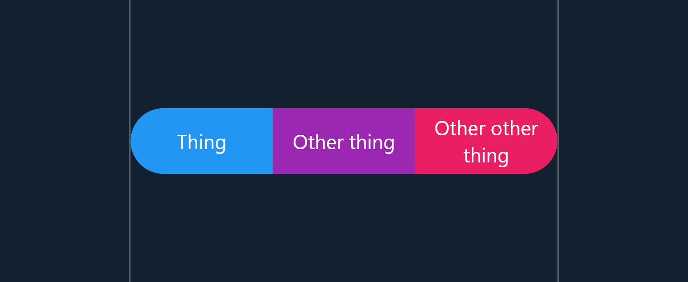

# Evenly Sized Row

In this example we take a simple row of widgets and make each of them the same size. This one is a little harder than the previous example because there are an arbitrary number of children.

### Original Layout

If we throw three text widgets in a Row it looks a little ugly:



```dart
class MyWidget extends StatelessWidget {
  const MyWidget({Key? key}) : super(key: key);

  @override
  Widget build(BuildContext context) {
    return Row(
      mainAxisAlignment: MainAxisAlignment.center,
      children: [
        Material(
          borderRadius: const BorderRadius.horizontal(
            left: Radius.circular(100),
          ),
          color: Colors.blue,
          child: Container(
            padding: const EdgeInsets.all(4.0),
            alignment: Alignment.center,
            child: const Text('Thing', textAlign: TextAlign.center),
          ),
        ),
        Material(
          color: Colors.purple,
          child: Container(
            padding: const EdgeInsets.all(4.0),
            alignment: Alignment.center,
            child: const Text(
              'Other thing',
              textAlign: TextAlign.center,
            ),
          ),
        ),
        Material(
          borderRadius: const BorderRadius.horizontal(
            right: Radius.circular(100),
          ),
          color: Colors.pink,
          child: Container(
            padding: const EdgeInsets.all(4.0),
            alignment: Alignment.center,
            child: const Text('Other other thing', textAlign: TextAlign.center),
          ),
        ),
      ],
    );
  }
}
```

### Complete Example

To make this row prettier we want each child to be the same width, fortunately [CustomBoxy](https://pub.dev/documentation/boxy/latest/boxy/CustomBoxy-class.html) allows us to do that:



```dart
class EvenSized extends StatelessWidget {
  const EvenSized({
    Key? key,
    required this.children,
  }) : super(key: key);

  final List<Widget> children;

  @override
  Widget build(BuildContext context) {
    return CustomBoxy(
      delegate: EvenSizedBoxy(),
      children: children,
    );
  }
}

class EvenSizedBoxy extends BoxyDelegate {
  @override
  Size layout() {
    // Find the max intrinsic width of each child
    //
    // Intrinsics are a little scary but `getMaxIntrinsicWidth(double.infinity)`
    // just calculates the width of the child as if its maximum height is
    // infinite
    var childWidth = 0.0;
    for (final child in children) {
      childWidth = max(
        childWidth,
        child.render.getMaxIntrinsicWidth(double.infinity),
      );
    }

    // Clamp the width so children don't overflow
    childWidth = min(childWidth, constraints.maxWidth / children.length);

    // Find the max intrinsic height
    //
    // We calculate childHeight after childWidth because the height of text
    // depends on its width (i.e. wrapping), `getMinIntrinsicHeight(childWidth)`
    // calculates what the child's height would be if it's width is childWidth.
    var childHeight = 0.0;
    for (final child in children) {
      childHeight = max(
        childHeight,
        child.render.getMinIntrinsicHeight(childWidth),
      );
    }

    // Force each child to be the same size
    final childConstraints = BoxConstraints.tight(
      Size(childWidth, childHeight),
    );

    var x = 0.0;
    for (final child in children) {
      child.layout(childConstraints);

      // Space them out evenly
      child.position(Offset(x, 0));
      x += childWidth;
    }

    return Size(childWidth * children.length, childHeight);
  }
}
```

Constraining the layout's width shows that the children are distributed evenly and don't overflow, the text has correct wrapping behavior as well:


