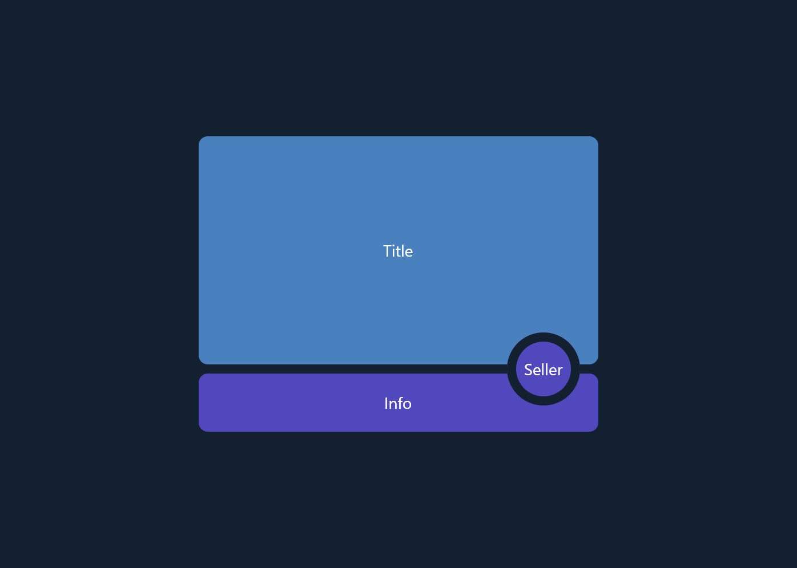
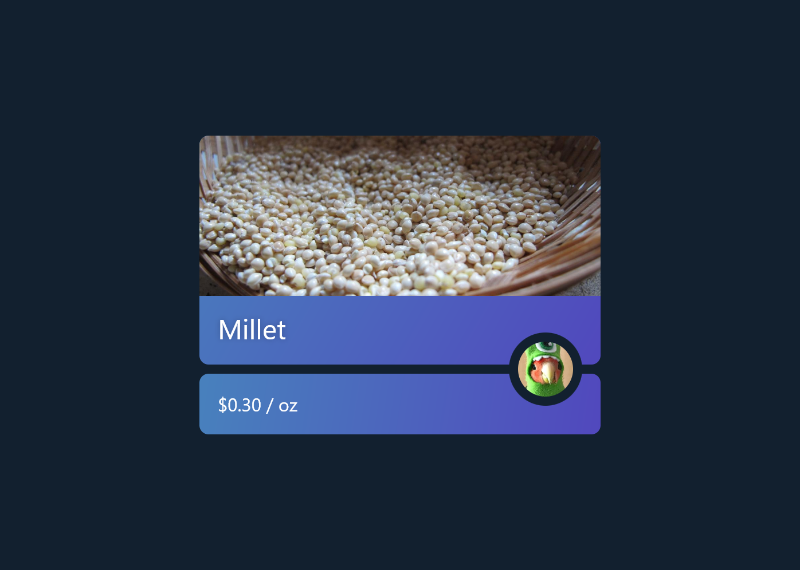
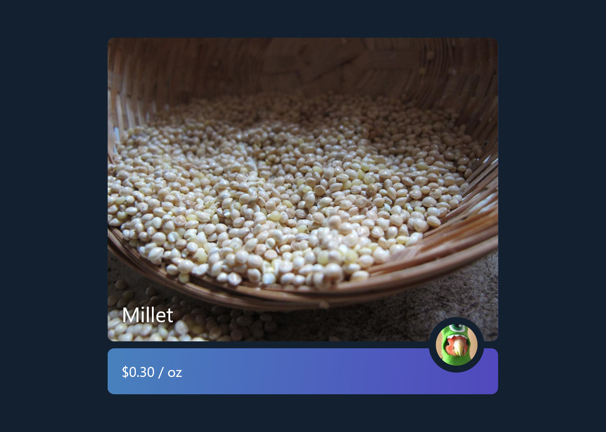
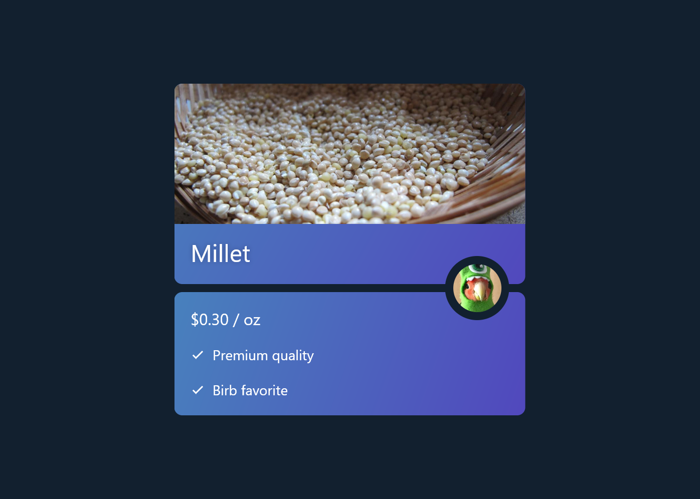
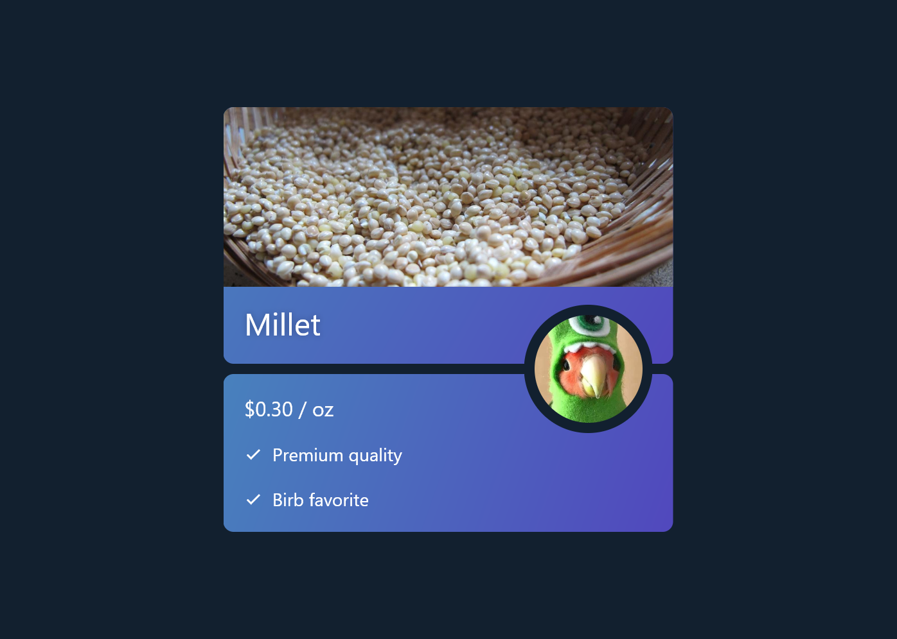
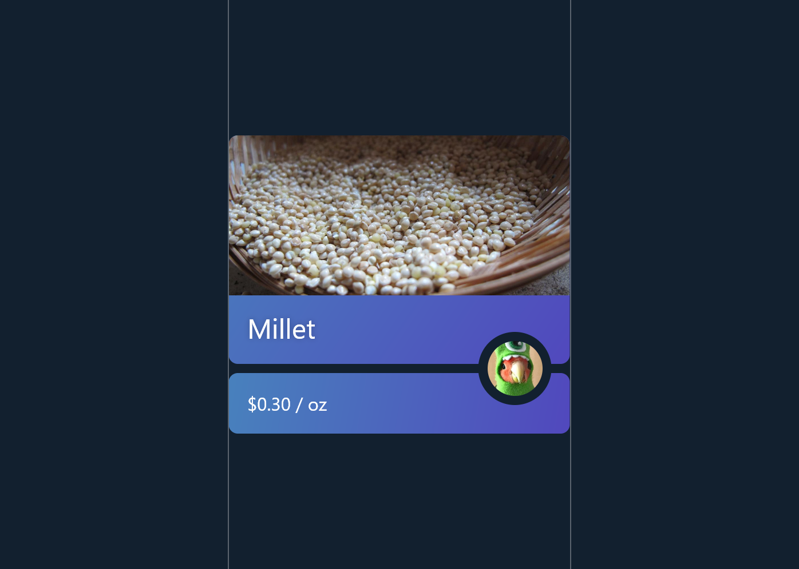

# Product Tile

This is an interesting layout I stumbled upon when searching StackOverflow, it contains Title, Seller, and Info widgets arranged so that the Seller is positioned above the space between Title and Info.

Normally for something like this you would use Stack, but that unfortunately doesn't work if each widget is interactable and has a dynamic size.

### Complete Example



```dart
class MyWidget extends StatelessWidget {
  const MyWidget({Key? key}) : super(key: key);

  @override
  Widget build(BuildContext context) {
    return ProductTile(
      title: Container(
        decoration: BoxDecoration(
          color: const Color(0xff4881bd),
          borderRadius: BorderRadius.circular(8.0),
        ),
        width: 350,
        height: 200,
        alignment: Alignment.center,
        child: const Text('Title'),
      ),
      seller: Container(
        decoration: BoxDecoration(
          color: const Color(0xff5148bd),
          border: Border.all(color: darkBlue, width: 8),
          shape: BoxShape.circle,
        ),
        alignment: Alignment.center,
        child: const Text('Seller'),
        width: 64,
        height: 64,
      ),
      info: Container(
        decoration: BoxDecoration(
          color: const Color(0xff5148bd),
          borderRadius: BorderRadius.circular(8.0),
        ),
        alignment: Alignment.center,
        child: const Text('Info'),
        padding: const EdgeInsets.all(16.0),
      ),
    );
  }
}

@immutable
class ProductTileStyle {
  /// How far to the left the seller is inset
  final double sellerInset;

  /// The size of the gap between the title and description
  final double gapHeight;

  const ProductTileStyle({
    this.sellerInset = 16.0,
    this.gapHeight = 8.0,
  });

  @override
  bool operator ==(Object? other) =>
      identical(this, other) ||
      (other is ProductTileStyle &&
          other.sellerInset == sellerInset &&
          other.gapHeight == gapHeight);

  @override
  int get hashCode => hashValues(sellerInset, gapHeight);
}

class ProductTile extends StatelessWidget {
  final Widget title;
  final Widget info;
  final Widget seller;
  final ProductTileStyle style;

  const ProductTile({
    Key? key,
    required this.title,
    required this.info,
    required this.seller,
    this.style = const ProductTileStyle(),
  }) : super(key: key);

  @override
  Widget build(context) {
    return CustomBoxy(
      delegate: ProductTileDelegate(style: style),
      children: [
        // Children are in paint order, put the seller last so it can sit
        // above the others
        BoxyId(id: #title, child: title),
        BoxyId(id: #info, child: info),
        BoxyId(id: #seller, child: seller),
      ],
    );
  }
}

class ProductTileDelegate extends BoxyDelegate {
  final ProductTileStyle style;

  ProductTileDelegate({required this.style});

  @override
  Size layout() {
    // We can grab children by name using BoxyId and getChild
    final title = getChild(#title);
    final seller = getChild(#seller);
    final info = getChild(#info);

    // Lay out the seller first so it can provide a minimum height to the title
    // and info
    final sellerSize = seller.layout(constraints.deflate(
      EdgeInsets.only(right: style.sellerInset),
    ));

    // Lay out and position the title
    final titleSize = title.layout(constraints.copyWith(
      minHeight: sellerSize.height / 2 + style.gapHeight / 2,
    ));
    title.position(Offset.zero);

    // Position the seller at the bottom right of the title, offset to the left
    // by sellerInset
    seller.position(Offset(
      titleSize.width - (sellerSize.width + style.sellerInset),
      (titleSize.height - sellerSize.height / 2) + style.gapHeight / 2,
    ));

    // Lay out info to match the width of title and position it below the title
    final infoSize = info.layout(BoxConstraints(
      minHeight: sellerSize.height / 2,
      minWidth: titleSize.width,
      maxWidth: titleSize.width,
    ));
    info.position(Offset(0, titleSize.height + style.gapHeight));

    return Size(
      titleSize.width,
      titleSize.height + infoSize.height + style.gapHeight,
    );
  }

  // Any BoxyDelegate with parameters should always implement shouldRelaout,
  // otherwise it won't update when its properties do.
  @override
  bool shouldRelayout(ProductTileDelegate oldDelegate) =>
      style != oldDelegate.style;
}
```

With some images and text, we get a finished product tile that is fully adaptive:










