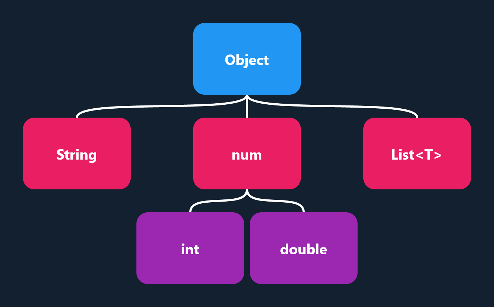

# Tree View

This example shows a tree with nodes of an arbitrary size, it uses a recursive algorithm to measure and position each
child.

### Complete Example



[:simple-dart: DartPad](https://dartpad.boxy.wiki/?id=1c3788eb210600ca948ac9cde172ce64){ .md-button .md-button--primary .block }

```dart
class MyWidget extends StatelessWidget {
  const MyWidget({Key? key}) : super(key: key);

  @override
  Widget build(BuildContext context) {
    return const TreeView(
      root: TreeNode(
        ExampleNode('Object', Colors.blue),
        [
          TreeNode(ExampleNode('String', Colors.pink)),
          TreeNode(ExampleNode('num', Colors.pink), [
            TreeNode(ExampleNode('int', Colors.purple)),
            TreeNode(ExampleNode('double', Colors.purple)),
          ]),
          TreeNode(ExampleNode('List<T>', Colors.pink)),
        ],
      ),
      horizontalSpacing: 8,
      verticalSpacing: 32,
    );
  }
}

class ExampleNode extends StatelessWidget {
  const ExampleNode(
      this.label,
      this.color, {
        Key? key,
        this.size = const Size(150, 100),
      }) : super(key: key);

  final String label;
  final Color color;
  final Size size;

  @override
  Widget build(BuildContext context) {
    return Container(
      width: size.width,
      height: size.height,
      decoration: BoxDecoration(
        color: color,
        borderRadius: BorderRadius.circular(16.0),
      ),
      child: Center(
        child: Text(
          label,
          style: const TextStyle(
            fontSize: 20.0,
            fontWeight: FontWeight.bold,
            color: Colors.white,
          ),
        ),
      ),
    );
  }
}

/// A node in our tree containing a widget and a list of child nodes.
class TreeNode {
  const TreeNode(this.widget, [this.children = const []]);

  final Widget widget;
  final List<TreeNode> children;

  // A flat iterable of all of the nodes in this subtree.
  Iterable<TreeNode> get flatten =>
      [this].followedBy(children.expand((e) => e.flatten));
}

class TreeView extends StatelessWidget {
  const TreeView({
    required this.root,
    required this.verticalSpacing,
    required this.horizontalSpacing,
    super.key,
  });

  final TreeNode root;
  final double verticalSpacing;
  final double horizontalSpacing;

  @override
  Widget build(BuildContext context) {
    return CustomBoxy(
      delegate: _TreeViewBoxy(
        root: root,
        verticalSpacing: verticalSpacing,
        horizontalSpacing: horizontalSpacing,
      ),
      // Flatten the tree into a single list of widgets.
      children: [...root.flatten.map((e) => e.widget)],
    );
  }
}

class _TreeViewBoxy extends BoxyDelegate {
  _TreeViewBoxy({
    required this.root,
    required this.verticalSpacing,
    required this.horizontalSpacing,
  });

  final TreeNode root;
  final double verticalSpacing;
  final double horizontalSpacing;

  @override
  Size layout() {
    var index = 0;
    Size visit(TreeNode node, Offset offset) {
      final nodeIndex = index++;
      final child = children[nodeIndex];
      final size = child.layout(const BoxConstraints());
      final Size subtreeSize;

      if (node.children.isEmpty) {
        subtreeSize = size;
      } else {
        // Loop through all children to get the total size of the subtree.
        var width = 0.0;
        var height = 0.0;
        var x = 0.0;
        final y = offset.dy + child.size.height + verticalSpacing;
        for (final child in node.children) {
          final childSize = visit(child, Offset(offset.dx + x, y));
          height = max(height, childSize.height);
          width += childSize.width;
          x += childSize.width + horizontalSpacing;
        }

        // Account for spacing.
        width += (node.children.length - 1) * horizontalSpacing;

        subtreeSize = Size(
          max(width, size.width),
          size.height + height + verticalSpacing,
        );
      }

      // Position the node in the center of its subtree.
      child.position(
        offset + Offset(subtreeSize.width / 2 - child.size.width / 2, 0),
      );

      return subtreeSize;
    }

    return visit(root, Offset.zero);
  }

  @override
  void paint() {
    final path = Path();
    var index = 0;
    void visit(TreeNode node) {
      final nodeOffset = children[index++].rect.bottomCenter;
      for (final child in node.children) {
        final childOffset = children[index].rect.topCenter;
        final distance = (childOffset.dx - nodeOffset.dx).abs();
        final ratio = min(1.0, distance / verticalSpacing) * 0.9;
        path
          ..moveTo(nodeOffset.dx, nodeOffset.dy)
          ..cubicTo(
            nodeOffset.dx,
            nodeOffset.dy + verticalSpacing * ratio,
            childOffset.dx,
            childOffset.dy - verticalSpacing * ratio,
            childOffset.dx,
            childOffset.dy,
          );
        visit(child);
      }
    }

    visit(root);
    canvas.drawPath(
      path,
      Paint()
        ..color = Colors.white
        ..style = PaintingStyle.stroke
        ..strokeCap = StrokeCap.round
        ..strokeWidth = 3.0,
    );
  }

  @override
  bool shouldRelayout(_TreeViewBoxy oldDelegate) =>
      root != oldDelegate.root ||
          verticalSpacing != oldDelegate.verticalSpacing ||
          horizontalSpacing != oldDelegate.horizontalSpacing;
}
```
