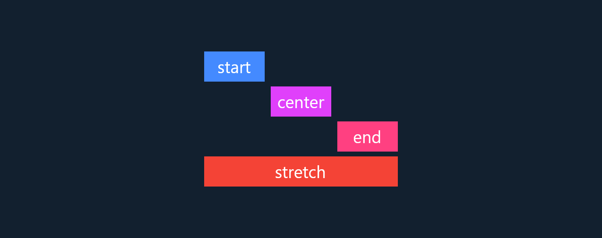

# Cross-axis alignment

One of the limitations of a regular [Row](https://api.flutter.dev/flutter/widgets/Row-class.html) or [Column](https://api.flutter.dev/flutter/widgets/Column-class.html) is not being able to use a different cross-axis alignment for each child.

[BoxyFlexible.align](https://pub.dev/documentation/boxy/latest/flex/BoxyFlexible/BoxyFlexible.align.html) lets you do exactly that:



```dart
class MyWidget extends StatelessWidget {
  const MyWidget({Key? key}) : super(key: key);

  @override
  Widget build(BuildContext context) {
    return SizedBox(
      width: 100,
      child: BoxyColumn(
        mainAxisSize: MainAxisSize.min,
        crossAxisAlignment: CrossAxisAlignment.center,
        children: [
          BoxyFlexible.align(
            child: Container(
              width: 50,
              height: 25,
              color: Colors.blueAccent,
              alignment: Alignment.center,
              child: const Text('start'),
            ),
            crossAxisAlignment: CrossAxisAlignment.start,
          ),
          const SizedBox(height: 4),
          BoxyFlexible.align(
            child: Container(
              width: 50,
              height: 25,
              color: Colors.purpleAccent,
              alignment: Alignment.center,
              child: const Text('center'),
            ),
            crossAxisAlignment: CrossAxisAlignment.center,
          ),
          const SizedBox(height: 4),
          BoxyFlexible.align(
            child: Container(
              width: 50,
              height: 25,
              color: Colors.pinkAccent,
              alignment: Alignment.center,
              child: const Text('end'),
            ),
            crossAxisAlignment: CrossAxisAlignment.end,
          ),
          const SizedBox(height: 4),
          BoxyFlexible.align(
            child: Container(
              height: 25,
              color: Colors.red,
              alignment: Alignment.center,
              child: const Text('stretch'),
            ),
            crossAxisAlignment: CrossAxisAlignment.stretch,
          ),
        ],
      ),
    );
  }
}
```
