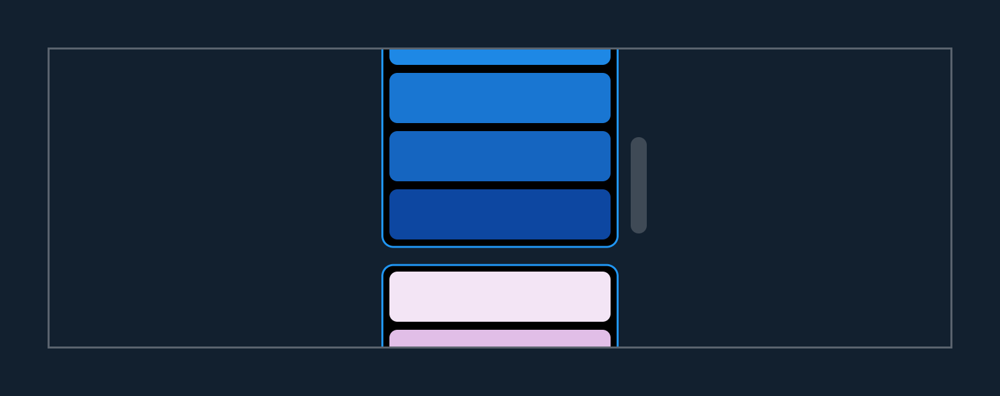
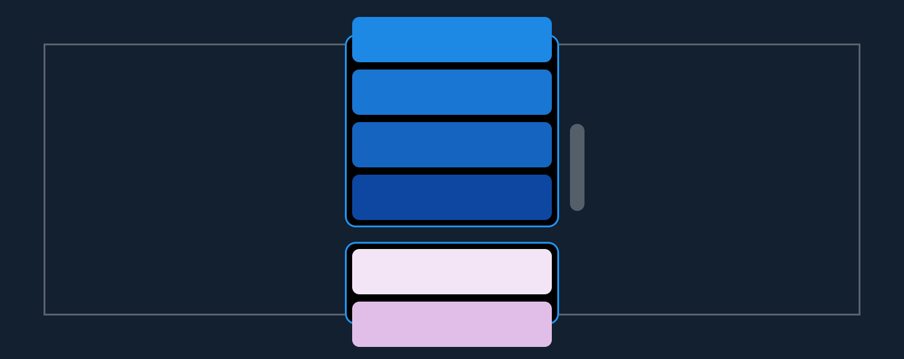

# SliverContainer

[SliverContainer](https://pub.dev/documentation/boxy/latest/slivers/SliverContainer-class.html) is a sliver that gives its sliver a foreground or background box widget, this is useful if you want a sliver to look and feel like the child of a regular widget.

In the below example we have two [SliverLists](https://api.flutter.dev/flutter/widgets/SliverList-class.html) with [DecoratedBox](https://api.flutter.dev/flutter/widgets/DecoratedBox-class.html) as a background:



By giving the [CustomScrollView](https://api.flutter.dev/flutter/widgets/CustomScrollView-class.html) a clip of [Clip.none](https://api.flutter.dev/flutter/dart-ui/Clip.html), you can see how this is possible:



The [DecoratedBoxes](https://api.flutter.dev/flutter/widgets/DecoratedBox-class.html) are stretched so that their top and bottom edge are barely out of view, while the contents of [SliverList](https://api.flutter.dev/flutter/widgets/SliverList-class.html) are still lazily built.

```dart
final colors = [
  [
    Colors.blue.shade50,
    Colors.blue.shade100,
    Colors.blue.shade200,
    Colors.blue.shade300,
    Colors.blue.shade400,
    Colors.blue.shade500,
    Colors.blue.shade600,
    Colors.blue.shade700,
    Colors.blue.shade800,
    Colors.blue.shade900,
  ],
  [
    Colors.purple.shade50,
    Colors.purple.shade100,
    Colors.purple.shade200,
    Colors.purple.shade300,
    Colors.purple.shade400,
    Colors.purple.shade500,
    Colors.purple.shade600,
    Colors.purple.shade700,
    Colors.purple.shade800,
    Colors.purple.shade900,
  ],
];

class MyWidget extends StatelessWidget {
  const MyWidget({Key? key}) : super(key: key);

  @override
  Widget build(BuildContext context) {
    return CustomScrollView(
      slivers: [
        for (var swatch in colors)
          SliverContainer(
            background: DecoratedBox(
              decoration: BoxDecoration(
                border: Border.all(color: Colors.blue),
                borderRadius: BorderRadius.circular(6.0),
                color: Colors.black,
              ),
            ),
            bufferExtent: 6.0,
            padding: const EdgeInsets.only(bottom: 4.0),
            margin: const EdgeInsets.symmetric(
              horizontal: 16.0,
              vertical: 4.0,
            ),
            sliver: SliverList(
              delegate: SliverChildBuilderDelegate(
                (context, index) {
                  return Container(
                    decoration: BoxDecoration(
                      color: swatch[index],
                      borderRadius: BorderRadius.circular(4.0),
                    ),
                    height: 25.0,
                    margin: const EdgeInsets.only(
                      left: 4.0,
                      right: 4.0,
                      top: 4.0,
                    ),
                  );
                },
                childCount: swatch.length,
              ),
            ),
          ),
      ],
    );
  }
}
```
