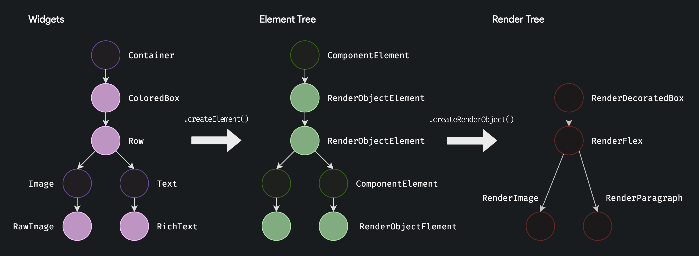

# The Many Trees

Before creating your own [RenderObject](https://api.flutter.dev/flutter/rendering/RenderObject-class.html), we should understand the relationship between the Widget, Element, and Render trees.

You are probably familiar with how [State](https://api.flutter.dev/flutter/widgets/State-class.html) works, it's a persistent instance with methods you can override to know when to initialize, build, and dispose.

State is actually just a fancy delegate for [ComponentElement](https://api.flutter.dev/flutter/widgets/ComponentElement-class.html) to hide it's ugly internals, other than that [Element](https://api.flutter.dev/flutter/widgets/Element-class.html) and [State](https://api.flutter.dev/flutter/widgets/State-class.html) are essentially the same thing!

Elements implement [BuildContext](https://api.flutter.dev/flutter/widgets/BuildContext-class.html), which also exists to hide ugly internals.

The Element tree is formed by recursively calling [Widget.createElement](https://api.flutter.dev/flutter/widgets/Widget/createElement.html), Flutter does the dirty work of reactively mounting, building, reparenting, and unmounting them for you.

When [RenderObjectElement](https://api.flutter.dev/flutter/widgets/RenderObjectElement-class.html)s are mounted they call [RenderObjectWidget.createRenderObject](https://api.flutter.dev/flutter/widgets/RenderObjectWidget/createRenderObject.html) to create a [RenderObject](https://api.flutter.dev/flutter/rendering/RenderObject-class.html).

For example, [ColoredBox](https://api.flutter.dev/flutter/widgets/ColoredBox-class.html) is a [SingleChildRenderObjectWidget](https://api.flutter.dev/flutter/widgets/SingleChildRenderObjectWidget-class.html) that creates a [SingleChildRenderObjectElement](https://api.flutter.dev/flutter/widgets/SingleChildRenderObjectElement-class.html), and [Row](https://api.flutter.dev/flutter/widgets/Row-class.html) is a [MultiChildRenderObjectWidget](https://api.flutter.dev/flutter/widgets/MultiChildRenderObjectWidget-class.html) that creates a [MultiChildRenderObjectElement](https://api.flutter.dev/flutter/widgets/MultiChildRenderObjectElement-class.html).

!!! note
    
    There is technically no such thing as a "widget tree", widgets are more like user-defined data structures that do not share a root node. People are usually referring to the element tree, since elements form a global tree and provide context.
